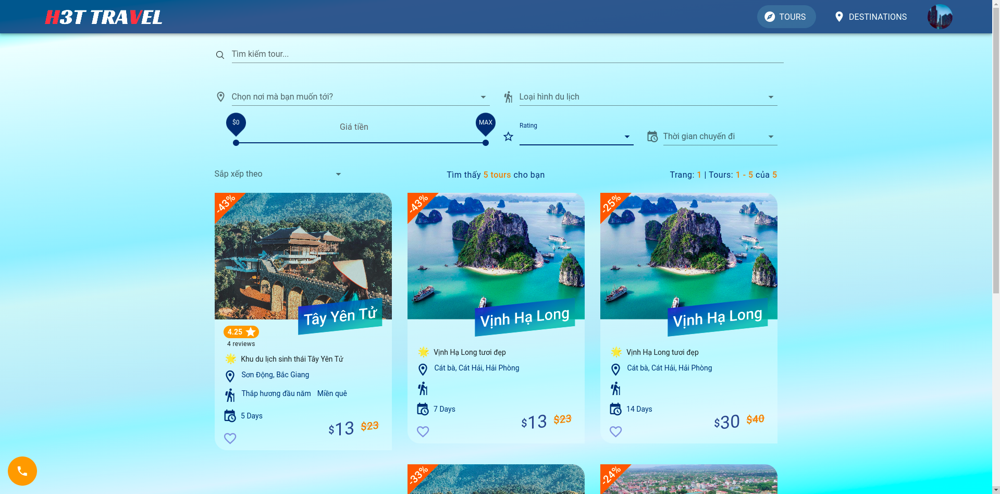
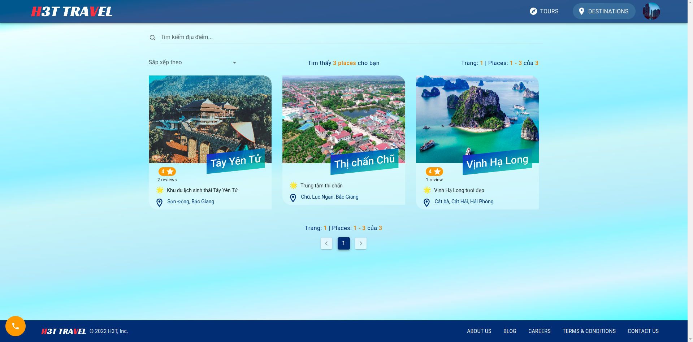
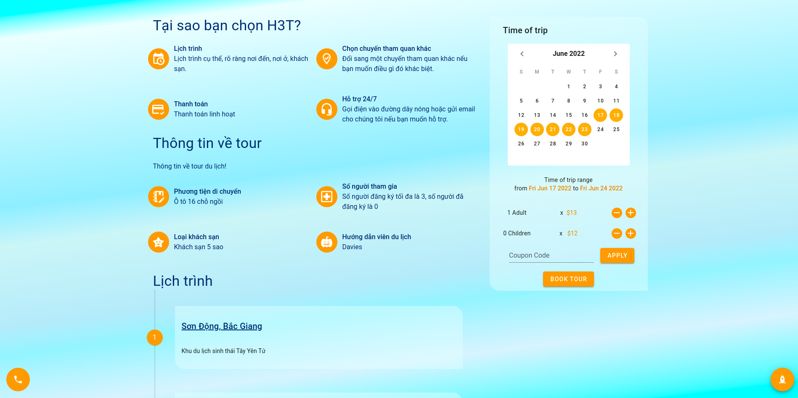
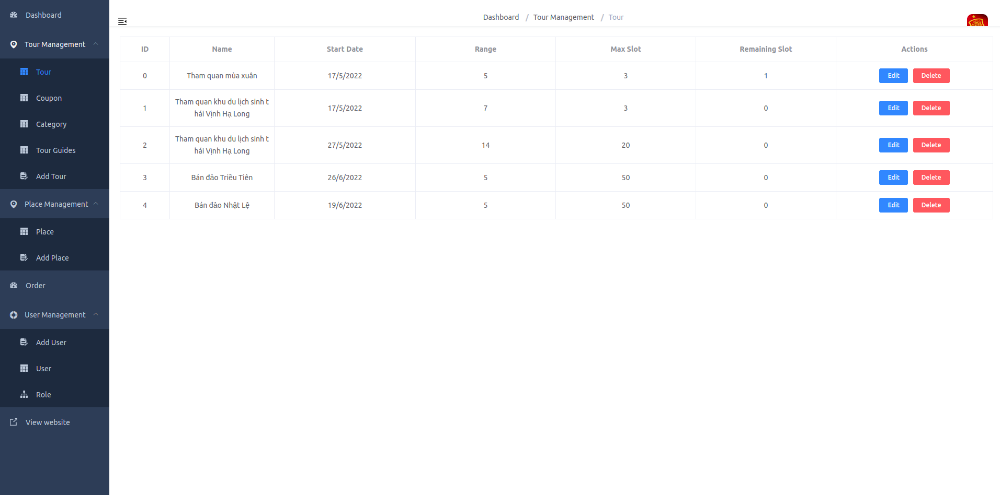
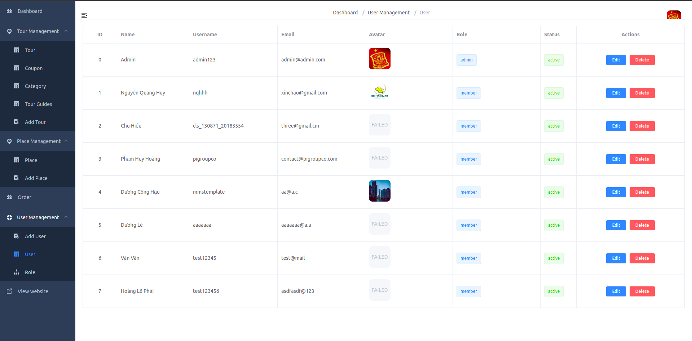

## Prerequisites

- composer 
- Run composer install and generate key: 

```bash
composer update
composer install 
php artisan key:generate
php artisan jwt:secret
```

- Create `.env` file: 

```
cp .env.example .env
```

Refer install composer in [https://www.digitalocean.com/community/tutorials/how-to-install-and-use-composer-on-ubuntu-20-04](https://www.digitalocean.com/community/tutorials/how-to-install-and-use-composer-on-ubuntu-20-04), and if you see bug `install ext-dom issue` you can solve issue with [https://stackoverflow.com/questions/43408604/php7-install-ext-dom-issue](https://stackoverflow.com/questions/43408604/php7-install-ext-dom-issue)


## Backend

Backend write with Laravel framework in traveltours-backend folder

## Frontend 

Frontend write with Vuejs framework in traveltours-frontend folder and admin-cms.

- Frontend for client: 







- Frontend for admin: 





## Install

```bash
cp .env.example .env
```

```bash
docker-compose up
```
